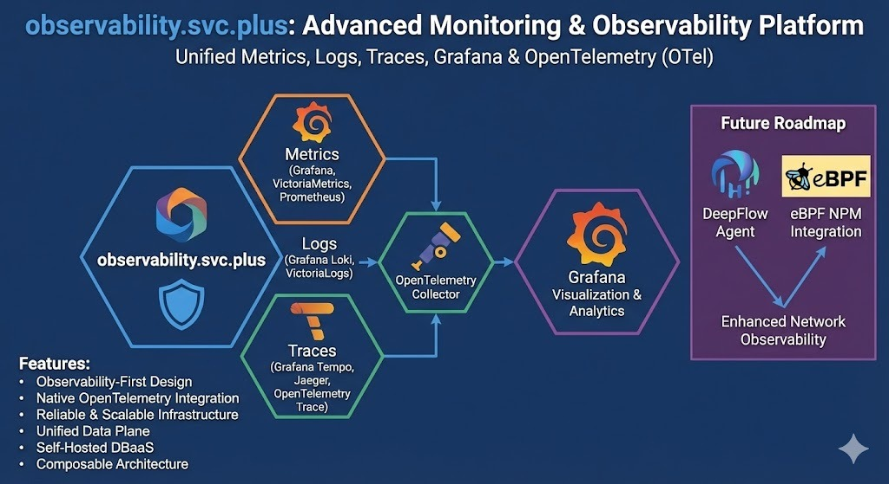

# Observability.svc.plus

[](LICENSE)
[](https://svc.plus)

**Observability.svc.plus** is an advanced observability platform strictly following the **Apache 2.0** license.

> **Focus**: Monitoring & Observability (监控/可观测). Integrating **OpenTelemetry (OTel)**, with future plans to incorporate **DeepFlow Agent** and other open-source **NPM** (Network Performance Monitoring) probes.

[Website](https://svc.plus/services) | [Public Demo](https://svc.plus/) | [Blog](https://svc.plus/blogs) | [Support](https://www.svc.plus/support)

[](https://observability.svc.plus)

## 🚀 快速开始

### 一键安装 (默认)
默认安装最新稳定版 , 默认使用当前主机名作为域名

```bash
curl -fsSL https://raw.githubusercontent.com/cloud-neutral-toolkit/observability.svc.plus/main/scripts/server-install.sh | bash
```

### 指定版本与域名 (安装建议)

```bash
curl -fsSL https://raw.githubusercontent.com/cloud-neutral-toolkit/observability.svc.plus/main/scripts/server-install.sh \
| bash -s --  observability.svc.plus
```


## Features

- **Observability First**:  SOTA monitoring for **PG** / **Infra** / **Node** based on **VictoriaMetrics**, **Grafana**, and **OpenTelemetry**.
- **OTel Integration**:     Native support for **OpenTelemetry**, facilitating unified trace, metric, and log ingestion.
- **Future Ready**:         Planned integration for **DeepFlow Agent** and other open-source **NPM** probes for deep network and application observability.
- **Reliable Base**:        Robust self-healing **HA** clusters, **PITR**, and secure infrastructure.
- **Maintainable**:         **One-Cmd Deploy**, **IaC** support, and easy customization.
- **Controllable**:         Self-sufficient Cloud Neutral FOSS. Run on **bare Linux**.

You can even use exotic [**PG kernel forks**](https://svc.plus/docs/pgsql/kernel) as an in-place replacement and wrap it as a full RDS service: 

| Kernel                                                     | Key Feature                     | Description                                    |
|------------------------------------------------------------|:--------------------------------|------------------------------------------------|
| [PostgreSQL](https://svc.plus/docs/pgsql/kernel/postgres) | **Extension Overwhelming**      | Vanilla PostgreSQL with 444 extensions         |
| [Citus](https://svc.plus/docs/pgsql/kernel/citus)         | **Horizontal Scaling**          | Distributive PostgreSQL via native extension   |
| [WiltonDB](https://svc.plus/docs/pgsql/kernel/babelfish)  | **SQL Server Migration**        | Microsoft SQL Server wire-compatibility        |
| [IvorySQL](https://svc.plus/docs/pgsql/kernel/ivorysql)   | **Oracle Migration**            | Oracle Grammar and PL/SQL compatible           |
| [OpenHalo](https://svc.plus/docs/pgsql/kernel/openhalo)   | **MySQL Migration**             | MySQL wire-protocol compatibility              |
| [Percona](https://svc.plus/docs/pgsql/kernel/percona)     | **Transparent Data Encryption** | Percona Distribution with pg_tde               |
| [FerretDB](https://svc.plus/docs/ferret)                  | **MongoDB Migration**           | MongoDB wire-protocol compatibility            |
| [OrioleDB](https://svc.plus/docs/pgsql/kernel/orioledbdb) | **OLTP Optimization**           | No bloat, No XID Wraparound, S3 Storage        |
| [PolarDB](https://svc.plus/docs/pgsql/kernel/polardb)     | **Aurora flavor RAC**           | RAC, China domestic compliance                 |
| [Supabase](https://svc.plus/docs/app/supabase)            | **Backend as Service**          | BaaS based on PostgreSQL, Firebase alternative |

And gather the synergistic superpowers of all [**444+ PostgreSQL Extensions**](https://pgext.cloud/list) all together:

[](https://pgext.cloud)


## Get Started

[](https://svc.plus/docs/pgsql)
[](https://svc.plus/docs/node)
[](https://svc.plus/docs/node)
[](https://svc.plus/docs/ref/linux#el)
[](https://svc.plus/docs/ref/linux#debian)
[](https://svc.plus/docs/ref/linux#ubuntu)
[](https://svc.plus/docs/setup/docker)

[**Prepare**](https://svc.plus/docs/deploy/prepare) a fresh `x86_64` / `aarch64` node runs any [**compatible**](https://svc.plus/docs/ref/linux) **Linux** OS Distros, then [**Install**](https://svc.plus/docs/setup/install#install) the platform with:

```bash
curl -fsSL https://raw.githubusercontent.com/cloud-neutral-toolkit/observability.svc.plus/main/scripts/server-install.sh | bash
```

Then [**configure**](https://svc.plus/docs/concept/iac/configure) and run the [**`deploy.yml`**](https://svc.plus/docs/setup/playbook) playbook with an [**admin user**](https://svc.plus/docs/deploy/admin) (**nopass** `ssh` & `sudo`):

```bash
./configure -g    # generate config and random passwords
./deploy.yml      # deploy everything on current node
```

Finally, you will get a [**singleton node ready**](https://svc.plus/docs/setup/install), with [**WebUI**](https://svc.plus/docs/setup/webui) on port `80/443` and [**Postgres**](https://svc.plus/docs/setup/pgsql) on port `5432`.

For dev/testing purposes, you can also run it inside [**Docker**](https://svc.plus/docs/setup/docker) containers: `cd docker; make launch`

--------

> [**Single-Node Setup**](https://svc.plus/docs/setup/install) | [**Production Deploy**](https://svc.plus/docs/deploy) | [**Offline Install**](https://svc.plus/docs/setup/offline) | [**Minimal Install**](https://svc.plus/docs/setup/slim) | [**Docker Install**](https://svc.plus/docs/setup/docker) | [**Run Supabase**](https://svc.plus/docs/app/supabase)

<details><summary>Install with the pig cli</summary><br>

Then you can launch pigsty with `pig sty` sub command:

```bash
curl -fsSL https://repo.pigsty.io/pig | bash # install pig
pig sty init     # install latest pigsty src to ~/pigsty 
pig sty conf     # auto-generate pigsty.yml config file
pig sty deploy   # run the deploy.yml playbook
```

</details>


## 🚀 快速开始

### 一键安装 (默认)
默认安装最新稳定版 , 默认使用当前主机名作为域名

```bash
curl -fsSL https://raw.githubusercontent.com/cloud-neutral-toolkit/observability.svc.plus/main/scripts/server-install.sh | bash
```

### 指定版本与域名 (安装建议)

```bash
# bash -s -- <版本> <域名>
curl -fsSL https://raw.githubusercontent.com/cloud-neutral-toolkit/observability.svc.plus/main/scripts/server-install.sh \
  | bash -s --  observability.svc.plus
```

## 🛠️ Client Agent Installation

To install observability agents (Node Exporter, Process Exporter, Vector) on a client machine and send data to this platform:

```bash
# bash -s -- --endpoint <YOUR_ENDPOINT>
curl -fsSL https://raw.githubusercontent.com/cloud-neutral-toolkit/observability.svc.plus/main/scripts/agent-install.sh \
  | bash -s -- --endpoint https://infra.svc.plus/ingest/otlp
```
> **Note**: The script automatically verifies the installation after setup.


## Features

- **Observability First**:  SOTA monitoring for **PG** / **Infra** / **Node** based on **VictoriaMetrics**, **Grafana**, and **OpenTelemetry**.
- **OTel Integration**:     Native support for **OpenTelemetry**, facilitating unified trace, metric, and log ingestion.
- **Future Ready**:         Planned integration for **DeepFlow Agent** and other open-source **NPM** probes for deep network and application observability.
- **Reliable Base**:        Inherits **Pigsty**'s robust self-healing **HA** clusters, **PITR**, and secure infrastructure.
- **Maintainable**:         **One-Cmd Deploy**, **IaC** support, and easy customization.
- **Controllable**:         Self-sufficient Cloud Neutral FOSS. Run on **bare Linux**.


--------

> [**Single-Node Setup**](https://svc.plus/docs/setup/install) | [**Production Deploy**](https://svc.plus/docs/deploy) | [**Offline Install**](https://svc.plus/docs/setup/offline) | [**Minimal Install**](https://svc.plus/docs/setup/slim) | [**Docker Install**](https://svc.plus/docs/setup/docker) | [**Run Supabase**](https://svc.plus/docs/app/supabase)


</details>


Integrated as a platform.

[](https://svc.plus/docs/infra) Nginx, Local Repo, DNSMasq, and the entire Victoria & Grafana observability stack.

The default [`deploy.yml`](deploy.yml) playbook will deploy `INFRA`, `NODE`, `ETCD` & `PGSQL` on the current node.
Which gives you an out-of-the-box PostgreSQL singleton instance (`admin_ip:5432`) with everything ready.

The node can be used as an admin controller to deploy & monitor more nodes & clusters. For example, you can install these **6** **OPTIONAL** [extra modules](https://svc.plus/docs/ref/module#extra-modules) for advanced use cases:

[](https://svc.plus/docs/minio) S3-compatible object storage service; used as an optional central backup server for `PGSQL`.

[](https://svc.plus/docs/infra) Deploy Redis servers in standalone master-replica, sentinel, and native cluster mode.

[](https://svc.plus/docs/ferret) Native support for FerretDB — adding MongoDB wire protocol compatibility to Postgres!

[](https://svc.plus/docs/docker) Launch optional docker daemons to run other stateless parts besides Pigsty RDS.

[](https://svc.plus/docs/juice) JuiceFS can mount S3/MinIO, and even PostgreSQL as a filesystem shared by multi users.

[](https://svc.plus/docs/vibe) Vibe coding environment with VS Code Server, JupyterLab, Node.js, and Claude Code.

Of course, you can deploy different kinds of HA **PostgreSQL** clusters on multiple nodes, as much as you want.


----------------

## PostgreSQL RDS

To deploy an [**additional**](https://svc.plus/docs/deploy) 3-node HA Postgres cluster `pg-test`. Add the cluster [**definition**](https://github.com/pgsty/pigsty/blob/main/conf/ha/full.yml#L66) to the [**config inventory**](https://svc.plus/docs/concept/iac/inventory):

```yaml 
pg-test:
  hosts:
    10.10.10.11: { pg_seq: 1, pg_role: primary }
    10.10.10.12: { pg_seq: 2, pg_role: replica }
    10.10.10.13: { pg_seq: 3, pg_role: offline }
  vars: { pg_cluster: pg-test }
```

The default config file is [`pigsty.yml`](https://github.com/pgsty/pigsty/blob/main/pigsty.yml) under pigsty home, add the snippet above to the `all.children.pg-test`,
Then, create the cluster with built-in playbooks in one command:

```bash
bin/pgsql-add pg-test   # init pg-test cluster 
```

<details><summary>Example: Complex PostgreSQL Customization</summary><br>

This config file provides a detailed example of a complex PostgreSQL cluster `pg-meta` with multiple 
[databases](https://svc.plus/docs/pgsql/config/db), [users](https://svc.plus/docs/pgsql/config/user), and [service](https://svc.plus/docs/pgsql/service) definition:

```yaml
pg-meta:
  hosts: { 10.10.10.10: { pg_seq: 1, pg_role: primary , pg_offline_query: true } }
  vars:
    pg_cluster: pg-meta
    pg_databases:                       # define business databases on this cluster, array of database definition
      - name: meta                      # REQUIRED, `name` is the only mandatory field of a database definition
        baseline: cmdb.sql              # optional, database sql baseline path, (relative path among ansible search path, e.g files/)
        pgbouncer: true                 # optional, add this database to pgbouncer database list? true by default
        schemas: [pigsty]               # optional, additional schemas to be created, array of schema names
        extensions:                     # optional, additional extensions to be installed: array of `{name[,schema]}`
          - { name: postgis , schema: public }
          - { name: timescaledb }
        comment: pigsty meta database   # optional, comment string for this database
        owner: postgres                # optional, database owner, postgres by default
        template: template1            # optional, which template to use, template1 by default
        encoding: UTF8                 # optional, database encoding, UTF8 by default. (MUST same as template database)
        locale: C                      # optional, database locale, C by default.  (MUST same as template database)
        lc_collate: C                  # optional, database collate, C by default. (MUST same as template database)
        lc_ctype: C                    # optional, database ctype, C by default.   (MUST same as template database)
        tablespace: pg_default         # optional, default tablespace, 'pg_default' by default.
        allowconn: true                # optional, allow connection, true by default. false will disable connect at all
        revokeconn: false              # optional, revoke public connection privilege. false by default. (leave connect with grant option to owner)
        register_datasource: true      # optional, register this database to grafana datasources? true by default
        connlimit: -1                  # optional, database connection limit, default -1 disable limit
        pool_auth_user: dbuser_meta    # optional, all connection to this pgbouncer database will be authenticated by this user
        pool_mode: transaction         # optional, pgbouncer pool mode at database level, default transaction
        pool_size: 64                  # optional, pgbouncer pool size at database level, default 64
        pool_size_reserve: 32          # optional, pgbouncer pool size reserve at database level, default 32
        pool_size_min: 0               # optional, pgbouncer pool size min at database level, default 0
        pool_max_db_conn: 100          # optional, max database connections at database level, default 100
        # shared parameters for CREATE DATABASE (shared with PostgreSQL)
        is_template: false             # optional, mark this database as template? default false
        strategy: wal_log              # optional (shared), PostgreSQL 15+, wal_log or file_copy
        locale_provider: libc          # optional (shared), PostgreSQL 15+, icu or libc
        icu_locale: ''                 # optional (shared), PostgreSQL 15+, ICU locale
        icu_rules: ''                  # optional (shared), PostgreSQL 16+, ICU rules
        builtin_locale: ''             # optional (shared), PostgreSQL 17+, builtin locale
        parameters: {}                 # optional, database-level parameters with `ALTER DATABASE SET`
      - { name: grafana  ,owner: dbuser_grafana  ,revokeconn: true ,comment: grafana primary database }
      - { name: bytebase ,owner: dbuser_bytebase ,revokeconn: true ,comment: bytebase primary database }
      - { name: kong     ,owner: dbuser_kong     ,revokeconn: true ,comment: kong the api gateway database }
      - { name: gitea    ,owner: dbuser_gitea    ,revokeconn: true ,comment: gitea meta database }
      - { name: wiki     ,owner: dbuser_wiki     ,revokeconn: true ,comment: wiki meta database }
    pg_users:                           # define business users/roles on this cluster, array of user definition
      - name: dbuser_meta               # REQUIRED, `name` is the only mandatory field of a user definition
        password: DBUser.Meta           # optional, password, can be a scram-sha-256 hash string or plain text
        login: true                     # optional, can log in, true by default  (new biz ROLE should be false)
        superuser: false                # optional, is superuser? false by default
        createdb: false                 # optional, can create database? false by default
        createrole: false               # optional, can create role? false by default
        inherit: true                   # optional, can this role use inherited privileges? true by default
        replication: false              # optional, can this role do replication? false by default
        bypassrls: false                # optional, can this role bypass row level security? false by default
        pgbouncer: true                 # optional, add this user to pgbouncer user-list? false by default (production user should be true explicitly)
        connlimit: -1                   # optional, user connection limit, default -1 disable limit
        expire_in: 3650                 # optional, now + n days when this role is expired (OVERWRITE expire_at)
        expire_at: '2030-12-31'         # optional, YYYY-MM-DD 'timestamp' when this role is expired  (OVERWRITTEN by expire_in)
        comment: pigsty admin user      # optional, comment string for this user/role
        roles: [dbrole_admin]           # optional, belonged roles. default roles are: dbrole_{admin,readonly,readwrite,offline}
        parameters: {}                  # optional, role level parameters with `ALTER ROLE SET`
        pool_mode: transaction          # optional, pgbouncer pool mode at user level, transaction by default
        pool_connlimit: -1              # optional, max database connections at user level, default -1 disable limit
        # shared parameters for CREATE ROLE (shared with PostgreSQL)
        # roles can also be defined in extended format for fine-grained control (PostgreSQL 16+)
        # roles:
        #   - dbrole_readwrite             # simple format: just grant the role
        #   - name: dbrole_admin           # extended format with options
        #     state: grant                 # grant (default) | revoke/absent
        #     admin: false                 # grant with admin option? (default false)
        #     inherit: true                # grant with inherit option? (PG16+, default null)
        #     set: true                    # grant with set option? (PG16+, default null)
      - {name: dbuser_view     ,password: DBUser.Viewer   ,pgbouncer: true ,roles: [dbrole_readonly], comment: read-only viewer for meta database}
      - {name: dbuser_grafana  ,password: DBUser.Grafana  ,pgbouncer: true ,roles: [dbrole_admin]    ,comment: admin user for grafana database   }
      - {name: dbuser_bytebase ,password: DBUser.Bytebase ,pgbouncer: true ,roles: [dbrole_admin]    ,comment: admin user for bytebase database  }
      - {name: dbuser_kong     ,password: DBUser.Kong     ,pgbouncer: true ,roles: [dbrole_admin]    ,comment: admin user for kong api gateway   }
      - {name: dbuser_gitea    ,password: DBUser.Gitea    ,pgbouncer: true ,roles: [dbrole_admin]    ,comment: admin user for gitea service      }
      - {name: dbuser_wiki     ,password: DBUser.Wiki     ,pgbouncer: true ,roles: [dbrole_admin]    ,comment: admin user for wiki.js service    }
    pg_services:                        # extra services in addition to pg_default_services, array of service definition
      # standby service will route {ip|name}:5435 to sync replica's pgbouncer (5435->6432 standby)
      - name: standby                   # required, service name, the actual svc name will be prefixed with `pg_cluster`, e.g: pg-meta-standby
        port: 5435                      # required, service exposed port (work as kubernetes service node port mode)
        ip: "*"                         # optional, service bind ip address, `*` for all ip by default
        selector: "[]"                  # required, service member selector, use JMESPath to filter inventory
        dest: default                   # optional, destination port, default|postgres|pgbouncer|<port_number>, 'default' by default
        check: /sync                    # optional, health check url path, / by default
        backup: "[? pg_role == `primary`]"  # backup server selector
        maxconn: 3000                   # optional, max allowed front-end connection
        balance: roundrobin             # optional, haproxy load balance algorithm (roundrobin by default, other: leastconn)
        #options: 'inter 3s fastinter 1s downinter 5s rise 3 fall 3 on-marked-down shutdown-sessions slowstart 30s maxconn 3000 maxqueue 128 weight 100'
    pg_hba_rules:
      - {user: dbuser_view , db: all ,addr: infra ,auth: pwd ,title: 'allow grafana dashboard access cmdb from infra nodes'}
    pg_vip_enabled: true
    pg_vip_address: 10.10.10.2/24
    pg_vip_interface: eth1
    pg_crontab:  # make a full backup 1 am everyday
      - '00 01 * * * /pg/bin/pg-backup full'

```

[](https://pigsty.io/img/pigsty/home.jpg)

</details>

It will create a cluster with everything properly configured: [**High Availability**](https://svc.plus/docs/concept/ha) powered by patroni & etcd; [**Point-In-Time-Recovery**](https://svc.plus/docs/concept/pitr) powered by pgBackRest & optional MinIO / S3;
auto-routed, pooled [**Services & Access**](https://svc.plus/docs/pgsql/service#default-service) pooled by pgBouncer and exposed by haproxy; and out-of-the-box [**Monitoring**](https://svc.plus/docs/pgsql/monitor/dashboard) & alerting powered by the **`INFRA`** module.

[](https://svc.plus/docs/concept/ha)

The cluster keeps serving as long as **ANY** instance survives, with excellent [fault-tolerance](https://svc.plus/docs/concept/ha/failure) performance:

> [**RPO = 0**](https://svc.plus/docs/concept/ha/rpo) on sync mode, **RPO < 1MB** on async mode; **RTO < 2s** on switchover, [**RTO < 30s**](https://svc.plus/docs/concept/ha/rto) on failover.


----------------

## Customization

Pigsty is highly customizable, You can describe the entire database and infra deployment with **300+** [**parameters**](https://svc.plus/docs/concept/iac/inventory) in a single config file and materialize them with one command.
There are many built-in configuration [**templates**](https://svc.plus/docs/concept/iac/template).

<details><summary>Example: Sandbox (4-node) with two PG cluster</summary><br>

The [`conf/full.yml`](https://github.com/pgsty/pigsty/blob/main/conf/full.yml) utilize four nodes to deploy two PostgreSQL clusters `pg-meta` and `pg-test`:

```yaml
pg-meta:
  hosts: { 10.10.10.10: { pg_seq: 1, pg_role: primary } }
  vars:
    pg_cluster: pg-meta
    pg_users:
      - {name: dbuser_meta     ,password: DBUser.Meta     ,pgbouncer: true ,roles: [dbrole_admin]    ,comment: pigsty admin user }
      - {name: dbuser_view     ,password: DBUser.Viewer   ,pgbouncer: true ,roles: [dbrole_readonly] ,comment: read-only viewer for meta database }
    pg_databases:
      - {name: meta ,baseline: cmdb.sql ,comment: pigsty meta database ,schemas: [pigsty]}
    pg_hba_rules:
      - {user: dbuser_view , db: all ,addr: infra ,auth: pwd ,title: 'allow grafana dashboard access cmdb from infra nodes'}
    pg_vip_enabled: true
    pg_vip_address: 10.10.10.2/24
    pg_vip_interface: eth1

# pgsql 3 node ha cluster: pg-test
pg-test:
  hosts:
    10.10.10.11: { pg_seq: 1, pg_role: primary }   # primary instance, leader of cluster
    10.10.10.12: { pg_seq: 2, pg_role: replica }   # replica instance, follower of leader
    10.10.10.13: { pg_seq: 3, pg_role: replica, pg_offline_query: true } # replica with offline access
  vars:
    pg_cluster: pg-test           # define pgsql cluster name
    pg_users:  [{ name: test , password: test , pgbouncer: true , roles: [ dbrole_admin ] }]
    pg_databases: [{ name: test }]
    pg_vip_enabled: true
    pg_vip_address: 10.10.10.3/24
    pg_vip_interface: eth1
```

You can even deploy PostgreSQL with different major versions and kernel forks in the same deployment:

[](https://svc.plus/docs/pgsql/kernel)

</details>

<details><summary>Example: Security Setup & Delayed Replica</summary><br>

The following [`conf/safe.yml`](https://github.com/pgsty/pigsty/blob/main/conf/ha/safe.yml) provision a 4-node [security](https://svc.plus/docs/deploy/security//) enhanced postgres cluster `pg-meta` with a delayed replica `pg-meta-delay`:

```yaml
pg-meta:      # 3 instance postgres cluster `pg-meta`
  hosts:
    10.10.10.10: { pg_seq: 1, pg_role: primary }
    10.10.10.11: { pg_seq: 2, pg_role: replica }
    10.10.10.12: { pg_seq: 3, pg_role: replica , pg_offline_query: true }
  vars:
    pg_cluster: pg-meta
    pg_conf: crit.yml
    pg_users:
      - { name: dbuser_meta , password: DBUser.Meta   , pgbouncer: true , roles: [ dbrole_admin ] , comment: pigsty admin user }
      - { name: dbuser_view , password: DBUser.Viewer , pgbouncer: true , roles: [ dbrole_readonly ] , comment: read-only viewer for meta database }
    pg_databases:
      - {name: meta ,baseline: cmdb.sql ,comment: pigsty meta database ,schemas: [pigsty] ,extensions: [{name: postgis, schema: public}, {name: timescaledb}]}
    pg_default_service_dest: postgres
    pg_services:
      - { name: standby ,src_ip: "*" ,port: 5435 , dest: default ,selector: "[]" , backup: "[? pg_role == `primary`]" }
    pg_vip_enabled: true
    pg_vip_address: 10.10.10.2/24
    pg_vip_interface: eth1
    pg_listen: '${ip},${vip},${lo}'
    patroni_ssl_enabled: true
    pgbouncer_sslmode: require
    pgbackrest_method: minio
    pg_libs: 'timescaledb, $libdir/passwordcheck, pg_stat_statements, auto_explain' # add passwordcheck extension to enforce strong password
    pg_default_roles:                 # default roles and users in postgres cluster
      - { name: dbrole_readonly  ,login: false ,comment: role for global read-only access     }
      - { name: dbrole_offline   ,login: false ,comment: role for restricted read-only access }
      - { name: dbrole_readwrite ,login: false ,roles: [dbrole_readonly]               ,comment: role for global read-write access }
      - { name: dbrole_admin     ,login: false ,roles: [pg_monitor, dbrole_readwrite]  ,comment: role for object creation }
      - { name: postgres     ,superuser: true  ,expire_in: 7300                        ,comment: system superuser }
      - { name: replicator ,replication: true  ,expire_in: 7300 ,roles: [pg_monitor, dbrole_readonly]   ,comment: system replicator }
      - { name: dbuser_dba   ,superuser: true  ,expire_in: 7300 ,roles: [dbrole_admin]  ,pgbouncer: true ,pool_mode: session, pool_connlimit: 16 , comment: pgsql admin user }
      - { name: dbuser_monitor ,roles: [pg_monitor] ,expire_in: 7300 ,pgbouncer: true ,parameters: {log_min_duration_statement: 1000 } ,pool_mode: session ,pool_connlimit: 8 ,comment: pgsql monitor user }
    pg_default_hba_rules:             # postgres host-based auth rules by default
      - {user: '${dbsu}'    ,db: all         ,addr: local     ,auth: ident ,title: 'dbsu access via local os user ident'  }
      - {user: '${dbsu}'    ,db: replication ,addr: local     ,auth: ident ,title: 'dbsu replication from local os ident' }
      - {user: '${repl}'    ,db: replication ,addr: localhost ,auth: ssl   ,title: 'replicator replication from localhost'}
      - {user: '${repl}'    ,db: replication ,addr: intra     ,auth: ssl   ,title: 'replicator replication from intranet' }
      - {user: '${repl}'    ,db: postgres    ,addr: intra     ,auth: ssl   ,title: 'replicator postgres db from intranet' }
      - {user: '${monitor}' ,db: all         ,addr: localhost ,auth: pwd   ,title: 'monitor from localhost with password' }
      - {user: '${monitor}' ,db: all         ,addr: infra     ,auth: ssl   ,title: 'monitor from infra host with password'}
      - {user: '${admin}'   ,db: all         ,addr: infra     ,auth: ssl   ,title: 'admin @ infra nodes with pwd & ssl'   }
      - {user: '${admin}'   ,db: all         ,addr: world     ,auth: cert  ,title: 'admin @ everywhere with ssl & cert'   }
      - {user: '+dbrole_readonly',db: all    ,addr: localhost ,auth: ssl   ,title: 'pgbouncer read/write via local socket'}
      - {user: '+dbrole_readonly',db: all    ,addr: intra     ,auth: ssl   ,title: 'read/write biz user via password'     }
      - {user: '+dbrole_offline' ,db: all    ,addr: intra     ,auth: ssl   ,title: 'allow etl offline tasks from intranet'}
    pgb_default_hba_rules:            # pgbouncer host-based authentication rules
      - {user: '${dbsu}'    ,db: pgbouncer   ,addr: local     ,auth: peer  ,title: 'dbsu local admin access with os ident'}
      - {user: 'all'        ,db: all         ,addr: localhost ,auth: pwd   ,title: 'allow all user local access with pwd' }
      - {user: '${monitor}' ,db: pgbouncer   ,addr: intra     ,auth: ssl   ,title: 'monitor access via intranet with pwd' }
      - {user: '${monitor}' ,db: all         ,addr: world     ,auth: deny  ,title: 'reject all other monitor access addr' }
      - {user: '${admin}'   ,db: all         ,addr: intra     ,auth: ssl   ,title: 'admin access via intranet with pwd'   }
      - {user: '${admin}'   ,db: all         ,addr: world     ,auth: deny  ,title: 'reject all other admin access addr'   }
      - {user: 'all'        ,db: all         ,addr: intra     ,auth: ssl   ,title: 'allow all user intra access with pwd' }

# OPTIONAL delayed cluster for pg-meta
pg-meta-delay:                    # delayed instance for pg-meta (1 hour ago)
  hosts: { 10.10.10.13: { pg_seq: 1, pg_role: primary, pg_upstream: 10.10.10.10, pg_delay: 1h } }
  vars: { pg_cluster: pg-meta-delay }
```

</details>


<details><summary>Example: Horizontal Sharding with Citus</summary><br>

You can perform horizontal sharding on vanilla postgres with [**`CITUS`**](https://svc.plus/docs/pgsql/kernel/citus/).

```yaml
# pg-citus: 10 node citus cluster (5 x primary-replica pair)
pg-citus: # citus group
  hosts:
    10.10.10.50: { pg_group: 0, pg_cluster: pg-citus0 ,pg_vip_address: 10.10.10.60/24 ,pg_seq: 0, pg_role: primary }
    10.10.10.51: { pg_group: 0, pg_cluster: pg-citus0 ,pg_vip_address: 10.10.10.60/24 ,pg_seq: 1, pg_role: replica }
    10.10.10.52: { pg_group: 1, pg_cluster: pg-citus1 ,pg_vip_address: 10.10.10.61/24 ,pg_seq: 0, pg_role: primary }
    10.10.10.53: { pg_group: 1, pg_cluster: pg-citus1 ,pg_vip_address: 10.10.10.61/24 ,pg_seq: 1, pg_role: replica }
    10.10.10.54: { pg_group: 2, pg_cluster: pg-citus2 ,pg_vip_address: 10.10.10.62/24 ,pg_seq: 0, pg_role: primary }
    10.10.10.55: { pg_group: 2, pg_cluster: pg-citus2 ,pg_vip_address: 10.10.10.62/24 ,pg_seq: 1, pg_role: replica }
    10.10.10.56: { pg_group: 3, pg_cluster: pg-citus3 ,pg_vip_address: 10.10.10.63/24 ,pg_seq: 0, pg_role: primary }
    10.10.10.57: { pg_group: 3, pg_cluster: pg-citus3 ,pg_vip_address: 10.10.10.63/24 ,pg_seq: 1, pg_role: replica }
    10.10.10.58: { pg_group: 4, pg_cluster: pg-citus4 ,pg_vip_address: 10.10.10.64/24 ,pg_seq: 0, pg_role: primary }
    10.10.10.59: { pg_group: 4, pg_cluster: pg-citus4 ,pg_vip_address: 10.10.10.64/24 ,pg_seq: 1, pg_role: replica }
  vars:
    pg_mode: citus                    # pgsql cluster mode: citus
    pg_shard: pg-citus                # citus shard name: pg-citus
    pg_primary_db: test               # primary database used by citus
    pg_dbsu_password: DBUser.Postgres # all dbsu password access for citus cluster
    pg_vip_enabled: true
    pg_vip_interface: eth1
    pg_extensions: [ 'citus postgis timescaledb pgvector' ]
    pg_libs: 'citus, timescaledb, pg_stat_statements, auto_explain' # citus will be added by patroni automatically
    pg_users: [ { name: test ,password: test ,pgbouncer: true ,roles: [ dbrole_admin ] } ]
    pg_databases: [ { name: test ,owner: test ,extensions: [ { name: citus }, { name: postgis } ] } ]
    pg_hba_rules:
      - { user: 'all' ,db: all  ,addr: 10.10.10.0/24 ,auth: trust ,title: 'trust citus cluster members'        }
      - { user: 'all' ,db: all  ,addr: 127.0.0.1/32  ,auth: ssl   ,title: 'all user ssl access from localhost' }
      - { user: 'all' ,db: all  ,addr: intra         ,auth: ssl   ,title: 'all user ssl access from intranet'  }
```

[](https://svc.plus/docs/pgsql/kernel/citus)

</details>


You can deploy different kinds of PostgreSQL instance such as [`primary`](https://svc.plus/docs/pgsql/config/cluster#primary), [`replica`](https://svc.plus/docs/pgsql/config/cluster#replica), [`offline`](https://svc.plus/docs/pgsql/config/cluster#offline), [`delayed`](https://svc.plus/docs/pgsql/config/cluster#delayed), [`sync standby`](https://svc.plus/docs/pgsql/config/cluster#sync-standby), etc.,
and customize with scene-optimize [**config templates**](https://svc.plus/docs/concept/iac/template) and all **444** [**extensions**](https://pgext.cloud/list) out-of-the-box.

You can define [**Users**](https://svc.plus/docs/pgsql/config/user), [**Databases**](https://svc.plus/docs/pgsql/config/db), [**Service**](https://svc.plus/docs/pgsql/service), [**HBAs**](https://svc.plus/docs/pgsql/config/hba) and other entities with code and provision them in one pass.

--------

You can also self-host postgres-centric software like [**`SUPABASE`**](https://svc.plus/docs/app/supabase), [**`Odoo`**](https://svc.plus/docs/app/odoo) & [**`Dify`**](https://svc.plus/docs/app/dify), Electric, GitLab, ... with Pigsty:

<details><summary>Example: Self-hosting Supabase</summary><br>

You can launch a [self-hosting supabase](https://svc.plus/docs/app/supabase) with MinIO and PostgreSQL with just several commands:

```bash
./configure -c supabase    # use supabase config 
./deploy.yml               # install pigsty
./docker.yml               # install docker compose
./app.yml                  # launch supabase stateless part with docker
```

The [`conf/supabase.yml`](https://github.com/pgsty/pigsty/blob/main/conf/supabase.yml) just describe everything you need:

```yaml
pg-meta:
  hosts: { 10.10.10.10: { pg_seq: 1, pg_role: primary } }
  vars:
    pg_cluster: pg-meta
    pg_users:
      # supabase roles: anon, authenticated, dashboard_user
      - { name: anon           ,login: false }
      - { name: authenticated  ,login: false }
      - { name: dashboard_user ,login: false ,replication: true ,createdb: true ,createrole: true }
      - { name: service_role   ,login: false ,bypassrls: true }
      # supabase users: please use the same password
      - { name: supabase_admin             ,password: 'DBUser.Supa' ,pgbouncer: true ,inherit: true   ,roles: [ dbrole_admin ] ,superuser: true ,replication: true ,createdb: true ,createrole: true ,bypassrls: true }
      - { name: authenticator              ,password: 'DBUser.Supa' ,pgbouncer: true ,inherit: false  ,roles: [ dbrole_admin, authenticated ,anon ,service_role ] }
      - { name: supabase_auth_admin        ,password: 'DBUser.Supa' ,pgbouncer: true ,inherit: false  ,roles: [ dbrole_admin ] ,createrole: true }
      - { name: supabase_storage_admin     ,password: 'DBUser.Supa' ,pgbouncer: true ,inherit: false  ,roles: [ dbrole_admin, authenticated ,anon ,service_role ] ,createrole: true }
      - { name: supabase_functions_admin   ,password: 'DBUser.Supa' ,pgbouncer: true ,inherit: false  ,roles: [ dbrole_admin ] ,createrole: true }
      - { name: supabase_replication_admin ,password: 'DBUser.Supa' ,replication: true ,roles: [ dbrole_admin ]}
      - { name: supabase_read_only_user    ,password: 'DBUser.Supa' ,bypassrls: true ,roles: [ dbrole_readonly, pg_read_all_data ] }
    pg_databases:
      - name: postgres
        baseline: supabase.sql
        owner: supabase_admin
        comment: supabase postgres database
        schemas: [ extensions ,auth ,realtime ,storage ,graphql_public ,supabase_functions ,_analytics ,_realtime ]
        extensions:
          - { name: pgcrypto  ,schema: extensions } # cryptographic functions
          - { name: pg_net    ,schema: extensions } # async HTTP
          - { name: pgjwt     ,schema: extensions } # json web token API for postgres
          - { name: uuid-ossp ,schema: extensions } # generate universally unique identifiers (UUIDs)
          - { name: pgsodium        }               # pgsodium is a modern cryptography library for Postgres.
          - { name: supabase_vault  }               # Supabase Vault Extension
          - { name: pg_graphql      }               # pg_graphql: GraphQL support
          - { name: pg_jsonschema   }               # pg_jsonschema: Validate json schema
          - { name: wrappers        }               # wrappers: FDW collections
          - { name: http            }               # http: allows web page retrieval inside the database.
          - { name: pg_cron         }               # pg_cron: Job scheduler for PostgreSQL
          - { name: timescaledb     }               # timescaledb: Enables scalable inserts and complex queries for time-series data
          - { name: pg_tle          }               # pg_tle: Trusted Language Extensions for PostgreSQL
          - { name: vector          }               # pgvector: the vector similarity search
          - { name: pgmq            }               # pgmq: A lightweight message queue like AWS SQS and RSMQ
    # supabase required extensions
    pg_libs: 'timescaledb, plpgsql, plpgsql_check, pg_cron, pg_net, pg_stat_statements, auto_explain, pg_tle, plan_filter'
    pg_parameters:
      cron.database_name: postgres
      pgsodium.enable_event_trigger: off
    pg_hba_rules: # supabase hba rules, require access from docker network
      - { user: all ,db: postgres  ,addr: intra         ,auth: pwd ,title: 'allow supabase access from intranet'    }
      - { user: all ,db: postgres  ,addr: 172.17.0.0/16 ,auth: pwd ,title: 'allow access from local docker network' }
    pg_crontab: [ '00 01 * * * /pg/bin/pg-backup full' ] # make a full backup every 1am
```


</details>

There are other pro, beta, or pilot modules, and there will be more coming in the future:

[](https://svc.plus/docs/pgsql/kernel/babelfish)
[](https://svc.plus/docs/pgsql/kernel/polardb)
[](https://svc.plus/docs/pgsql/kernel/polardb-o)
[](https://svc.plus/docs/pgsql/kernel/ivorysql)
[](https://svc.plus/docs/pgsql/kernel/greenplum)
[](https://svc.plus/docs/pgsql/kernel/cloudberry)
[](https://svc.plus/docs/pgsql/kernel/openhalo)
[](https://svc.plus/docs/pgsql/kernel/supabase)
[](https://svc.plus/docs/pilot/kafka)
[](https://svc.plus/docs/pilot/kafka)
[](https://svc.plus/docs/pilot/duckdb)
[](https://svc.plus/docs/pilot/tigerbeetle)
[](https://svc.plus/docs/pilot/victoria)
[](https://svc.plus/docs/pilot/kube)
[](https://svc.plus/docs/pilot/consul)
[](https://svc.plus/docs/vibe/)
[](https://svc.plus/docs/pilot)


----------------

## Compatibility

We recommend using RockyLinux 10.0, Debian 13.2, and Ubuntu 24.04.2 for production use.

Pigsty runs on bare linux directly, and focuses on active maintained mainstream LTS [**Linux Distros**](https://svc.plus/docs/ref/linux):

|   Code   | Distro                            |                      `x86_64`                       | Status |                       `aarch64`                       | Status |
|:--------:|-----------------------------------|:---------------------------------------------------:|:-------|:-----------------------------------------------------:|:-------|
| **EL10** | RHEL 10 / Rocky10 / Alma10 / ...  | [`el10.x86_64`](roles/node_id/vars/el10.x86_64.yml) | ✅📦    | [`el10.aarch64`](roles/node_id/vars/el10.aarch64.yml) | ✅📦    |
| **EL9**  | RHEL 9 / Rocky9 / Alma9 / ...     |  [`el9.x86_64`](roles/node_id/vars/el9.x86_64.yml)  | ✅📦    |  [`el9.aarch64`](roles/node_id/vars/el9.aarch64.yml)  | ✅📦    |
| **EL8**  | RHEL 8 / Rocky8 / Alma8 / Anolis8 |  [`el8.x86_64`](roles/node_id/vars/el8.x86_64.yml)  | ✅📦    |  [`el8.aarch64`](roles/node_id/vars/el8.aarch64.yml)  | ✅📦    |
| **U24**  | Ubuntu 24.04 (noble)              |  [`u24.x86_64`](roles/node_id/vars/u24.x86_64.yml)  | ✅📦    |  [`u24.aarch64`](roles/node_id/vars/u24.aarch64.yml)  | ✅📦    |
| **U22**  | Ubuntu 22.04 (jammy)              |  [`u22.x86_64`](roles/node_id/vars/u22.x86_64.yml)  | ✅📦    |  [`u22.aarch64`](roles/node_id/vars/u22.aarch64.yml)  | ✅📦    |
| **D13**  | Debian 13 (trixie)                |  [`d13.x86_64`](roles/node_id/vars/d13.x86_64.yml)  | ✅📦    |  [`d13.aarch64`](roles/node_id/vars/d13.aarch64.yml)  | ✅📦    |
| **D12**  | Debian 12 (bookworm)              |  [`d12.x86_64`](roles/node_id/vars/d12.x86_64.yml)  | ✅📦    |  [`d12.aarch64`](roles/node_id/vars/d12.aarch64.yml)  | ✅📦    |


## Sponsors

Many thanks to our contributors and sponsors for making Pigsty possible.
Special thanks to MiraclePlus for fund, to Cloudflare for hosting the Pigsty repo, and to Vercel for hosting the Pigsty website.

[](https://vercel.com/oss)


## License

Pigsty is licensed under [**Apache-2.0**](LICENSE) (since v4.0), Check [**Docs**](https://svc.plus/docs/about/license) for details.  


## About

[](https://svc.plus/docs)
[](https://github.com/pgsty/pigsty/discussions)
[](https://t.me/joinchat/gV9zfZraNPM3YjFh)
[](https://discord.gg/j5pG8qfKxU)
[](https://pigsty.io/img/pigsty/pigsty-cc.jpg)
[](https://qm.qq.com/q/vm8LIeUqGc)

[](https://vonng.com/)
[](https://vonng.com/en/)
[](mailto:rh@vonng.com)
[-red?logo=c&color=steelblue)](https://github.com/Vonng)
[](https://svc.plus/docs/about/license/)
[](https://pigsty.cc/docs/about/service)
