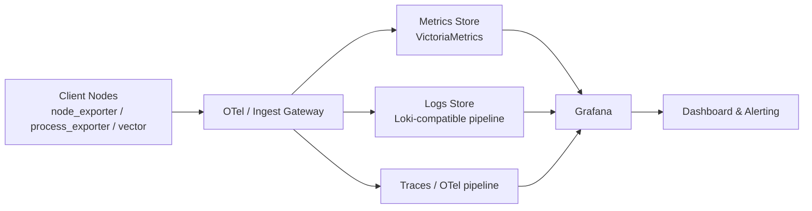

# Observability.svc.plus

[](LICENSE)
[](https://svc.plus)

**Observability.svc.plus** is an observability solution strictly following the Apache 2.0 license.

> **Focus**: Monitoring & Observability (监控/可观测). Integrating OpenTelemetry (OTel), with future plans to incorporate DeepFlow Agent and other open-source NPM (Network Performance Monitoring) probes.

[Website](https://svc.plus/) | [Public Demo](https://svc.plus/services) | [Blog](https://svc.plus/blogs) | [Support](https://www.svc.plus/support)

[](https://observability.svc.plus)

## 1) 概述

Observability.svc.plus provides a monitoring-focused stack for infrastructure and applications, centered on metrics, logs, and traces. It is designed for self-hosted, cloud-neutral operations with minimal vendor lock-in.

## 2) 架构图



## 3) Start

### Server side

```bash
curl -fsSL "https://raw.githubusercontent.com/cloud-neutral-toolkit/observability.svc.plus/main/scripts/server-install.sh?$(date +%s)" | bash -s -- observability.svc.plus
```

### Client side (agent)

```bash
# bash -s -- --endpoint <YOUR_ENDPOINT>
curl -fsSL https://raw.githubusercontent.com/cloud-neutral-toolkit/observability.svc.plus/main/scripts/agent-install.sh \
  | bash -s -- --endpoint https://observability.svc.plus/ingest/otlp
```

> **Note**
> - `--endpoint` supports both:
>   - `https://observability.svc.plus`
>   - `https://observability.svc.plus/ingest/otlp`
> - The installer auto-derives:
>   - metrics endpoint: `/ingest/metrics/api/v1/write`
>   - logs endpoint: `/ingest/logs/insert`
> - The script automatically verifies installation after setup.

### Remote client example (clawdbot.svc.plus)

```bash
ssh root@clawdbot.svc.plus \
  'curl -fsSL https://raw.githubusercontent.com/cloud-neutral-toolkit/observability.svc.plus/main/scripts/agent-install.sh \
    | bash -s -- --endpoint https://observability.svc.plus/ingest/otlp'
```

### Optional SSH manager env example

```bash
SSH_SERVER_CLAWBOT_HOST=clawdbot.svc.plus
SSH_SERVER_CLAWBOT_USER=root
SSH_SERVER_CLAWBOT_KEYPATH=~/.ssh/id_rsa
SSH_SERVER_CLAWBOT_PORT=22
SSH_SERVER_CLAWBOT_DESCRIPTION=clawdbot_server
```

## 4) Features

- **Observability First**: SOTA monitoring for PG / Infra / Node based on VictoriaMetrics, Grafana, and OpenTelemetry.
- **OTel Integration**: Native support for OpenTelemetry, facilitating unified trace, metric, and log ingestion.
- **Future Ready**: Planned integration for DeepFlow Agent and other open-source NPM probes for deep network and application observability.
- **Reliable Base**: Robust self-healing HA clusters, PITR, and secure infrastructure.
- **Maintainable**: One-Cmd Deploy, IaC support, and easy customization.
- **Controllable**: Self-sufficient Cloud Neutral FOSS. Run on bare Linux.

## 5) License & Upstream

- **License**: [Apache-2.0](LICENSE)
- **Upstream references**:
  - [Pigsty](https://github.com/pgsty/pigsty)
  - [OpenTelemetry](https://opentelemetry.io/)
  - [VictoriaMetrics](https://victoriametrics.com/)
  - [Grafana](https://grafana.com/)

## 6) 致谢

感谢开源社区与所有贡献者，特别是 observability、database、DevOps 相关项目维护者与实践者。
